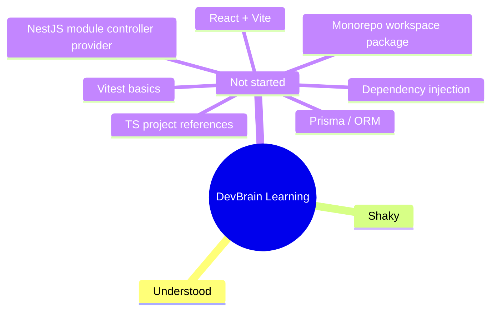

# Learning Log

Current phase: Phase 0 — Foundations

See also: global dev brain at `~/.claude/knowledge/dev-brain.md` — patterns,
tech/approach preferences, and general concepts that carry over to future projects
live there; this file stays scoped to DevBrain's learning.

This file is read by the SessionStart hook (`.claude/hooks/session-start-brain.py`),
which reports the concept counts below at the start of every session. The build loop
updates it (via the `learning-log` skill) each time a task introduces new concepts.

## Concepts & Knowledge

| Concept | Status | Last touched | Notes |
|---|---|---|---|
| Monorepo workspace package | not-started | 2026-07-14 | Introduced by DB0-05 (`packages/shared`). See [learn-log](learn-log/DB0-05-scaffold-shared.md) §4. |
| TypeScript project references (`tsc -b`, `composite`) | not-started | 2026-07-14 | Introduced by DB0-05. See [learn-log](learn-log/DB0-05-scaffold-shared.md) §4. |
| Vitest (test runner basics) | not-started | 2026-07-14 | Introduced by DB0-05. See [learn-log](learn-log/DB0-05-scaffold-shared.md) §4. |
| NestJS module/controller/provider + decorators | not-started | 2026-07-14 | Introduced by DB0-06 (`apps/api`, `/health`). See [learn-log](learn-log/DB0-06-scaffold-api.md) §4. |
| Dependency Injection (DI) | not-started | 2026-07-14 | First seen (trivially) in DB0-06; becomes concrete with `PrismaService` in DB0-07. |

Status values: `not-started`, `shaky`, `understood`.

## Mind Map

## Session Journal

### 2026-07-14

- Covered: set up the self-building harness (tasks backlog, hooks, learn-log) — no product code yet.
- Covered: DB0-01 through DB0-04 (repo hygiene, pnpm workspace, strict TS base config, ESLint/Prettier/husky) — all config, no learn-log needed.
- Covered: DB0-05 — first code package (`packages/shared`), first learn-log lesson written. Hit and fixed a real pnpm build-script security block (`ERR_PNPM_IGNORED_BUILDS` on esbuild) and a dist-pollution bug (tests leaking into the compiled build output).
- Covered: DB0-06 — first NestJS server (`apps/api`), modules/controllers/decorators/DI. Booted the compiled server and curled `/health` for real (not just a clean typecheck). Hit and fixed a missing `@types/node` typecheck error.
- Next: DB0-07 (Prisma in apps/api — DI becomes concrete with `PrismaService`).
