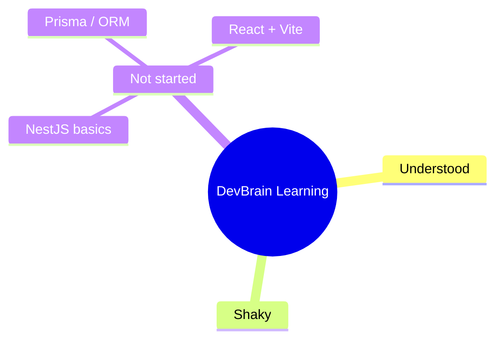

# Learning Log

Current phase: Phase 0 — Foundations

See also: global dev brain at `~/.claude/knowledge/dev-brain.md` — patterns,
tech/approach preferences, and general concepts that carry over to future projects
live there; this file stays scoped to DevBrain's learning.

This file is read by the SessionStart hook (`.claude/hooks/session-start-brain.py`),
which reports the concept counts below at the start of every session. The build loop
updates it (via the `learning-log` skill) each time a task introduces new concepts.

## Concepts & Knowledge

| Concept | Status | Last touched | Notes |
|---|---|---|---|
| (example) NestJS module/controller/provider | not-started | — | Will be introduced by DB0-06 (scaffold apps/api). Delete this example row once real rows exist. |

Status values: `not-started`, `shaky`, `understood`.

## Mind Map

## Session Journal

### 2026-07-14
- Covered: set up the self-building harness (tasks backlog, hooks, learn-log) — no product code yet.
- Next: run the loop; DB0-01 (editorconfig + README) then DB0-02 (pnpm workspace).
