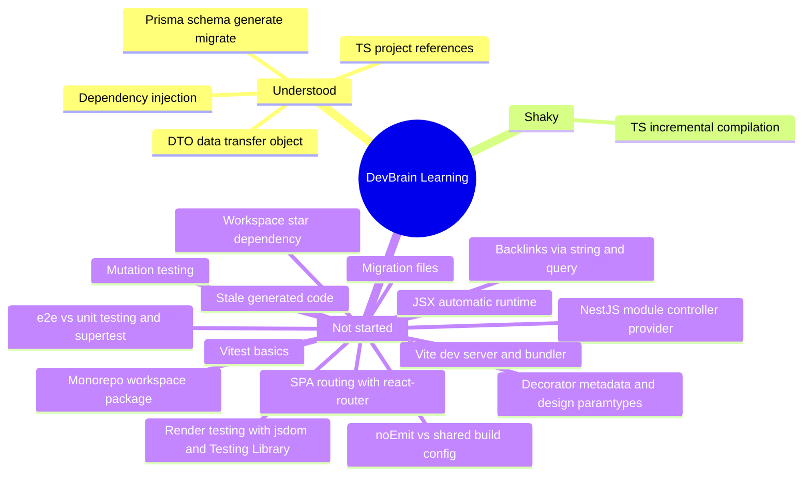

# Learning Log

Current phase: Phase 1 — Capture + DB core

See also: global dev brain at `~/.claude/knowledge/dev-brain.md` — patterns,
tech/approach preferences, and general concepts that carry over to future projects
live there; this file stays scoped to DevBrain's learning.

This file is read by the SessionStart hook (`.claude/hooks/session-start-brain.py`),
which reports the concept counts below at the start of every session. The build loop
updates it (via the `learning-log` skill) each time a task introduces new concepts.

## Concepts & Knowledge

| Concept | Status | Last touched | Notes |
|---|---|---|---|
| Monorepo workspace package | not-started | 2026-07-14 | Introduced by DB0-05 (`packages/shared`). See [learn-log](learn-log/DB0-05-scaffold-shared.md) §4. |
| TypeScript project references (`tsc -b`, `composite`) | understood | 2026-07-18 | Introduced by DB0-05, load-bearing in DB0-08 (`apps/web`). DB1-02 hit the *identical* fresh-clone `TS2307` failure independently in `apps/api` (its first-ever import of `@devbrain/shared`) and applied the identical fix (project reference + `tsc -b`) — diagnosed and fixed correctly twice, in two different packages, without needing to re-derive it. See [learn-log](learn-log/DB1-02-shared-capture-dtos.md) §4, §7. |
| DTO (Data Transfer Object) | understood | 2026-07-18 | Introduced by DB1-02 — a type describing data crossing a boundary (HTTP request/response), deliberately kept separate from the DB's internal shape. `CaptureDto.createdAt` is a `string`; Prisma's `Capture.createdAt` is a real `Date` — JSON has no date type, so the boundary type must differ from the storage type on purpose. Straightforward, no real struggle. See [learn-log](learn-log/DB1-02-shared-capture-dtos.md) §4. |
| `workspace:*` dependency (pnpm monorepo linking) | not-started | 2026-07-18 | `apps/web` had this since DB0-08, but DB1-02 is the first time it was added by hand in this build loop — `apps/api/package.json` got its first `workspace:*` dependency (`@devbrain/shared`), linked via `pnpm install` instead of publishing to npm. See [learn-log](learn-log/DB1-02-shared-capture-dtos.md) §4. |
| `noEmit` vs. a shared build config (the near-miss) | not-started | 2026-07-18 | DB1-02's real lesson: copying `apps/web`'s `noEmit: true` convention onto `apps/api/tsconfig.json` silently broke `nest build` — **zero output, no error** — because that file is shared between the typecheck script *and* the real application build (`nest build` reads it too), unlike web where Vite alone produces real output. Only caught by testing `nest build` in isolation before/after the change. Same family as DB1-01's stale Prisma client and DB0-07/DB0-08's `.tsbuildinfo` staleness: **verify a build artifact directly, don't trust a clean exit / no-error.** See [learn-log](learn-log/DB1-02-shared-capture-dtos.md) §7. |
| Vitest (test runner basics) | not-started | 2026-07-16 | Introduced by DB0-05; extended in DB0-09 to the api's e2e suite (chosen over Nest's default Jest for one runner repo-wide). See [learn-log](learn-log/DB0-09-vitest-supertest-api.md) §4–5. |
| Render testing (jsdom + Testing Library, query by role) | not-started | 2026-07-16 | Introduced by DB0-10 — jsdom is a fake browser in Node; `getByRole('heading', {name})` asserts *meaning* (real heading for a screen reader), not just that text exists. Replaces DB0-08's manual headless-browser ceremony. See [learn-log](learn-log/DB0-10-vitest-testing-library-web.md) §4. |
| Mutation testing (break it on purpose) | not-started | 2026-07-16 | Introduced by DB0-10 as a habit, earned by DB0-09's near-miss: a test that has never failed isn't evidence yet. Downgraded `<h1>` → `
` and confirmed the test caught it. See [learn-log](learn-log/DB0-10-vitest-testing-library-web.md) §7. |
| e2e vs unit testing + supertest | not-started | 2026-07-16 | Introduced by DB0-09 — boot the whole Nest app in memory, fake-HTTP it with supertest, no real port (contrast DB0-07's zombie server on port 3000). Template every later api route reuses. See [learn-log](learn-log/DB0-09-vitest-supertest-api.md) §4. |
| Decorator metadata (`emitDecoratorMetadata`, `design:paramtypes`) | not-started | 2026-07-16 | **The key idea behind DB0-09.** How Nest's DI knows what to inject. esbuild (vitest's default) can't emit it, so Nest silently injects `undefined` — no error. Fixed with SWC. See [learn-log](learn-log/DB0-09-vitest-supertest-api.md) §4, §7. |
| NestJS module/controller/provider + decorators | not-started | 2026-07-14 | Introduced by DB0-06 (`apps/api`, `/health`). See [learn-log](learn-log/DB0-06-scaffold-api.md) §4. |
| Dependency Injection (DI) | understood | 2026-07-16 | First seen (trivially) in DB0-06; became concrete in DB0-07 — `PrismaService` injected + `$connect()` verified via a real boot log. DB0-09 exposed the *mechanism* underneath it: DI only works because the compiler writes down constructor param types. See [learn-log](learn-log/DB0-09-vitest-supertest-api.md) §4. |
| ORM / Prisma (schema → generate → migrate) | understood | 2026-07-18 | The second pass DB0-07 flagged as needed: real models landed in DB1-01, `migrate dev` created + applied a migration, and a real CRUD probe (Capture → Concept → Link → backlink query) proved the typed client works end-to-end. Also caught and fixed a real gotcha — see "Stale generated code" below. See [learn-log](learn-log/DB1-01-prisma-schema-capture-concept-link.md). |
| Self-relation / reverse query (backlinks via string + query, not FK) | not-started | 2026-07-18 | Introduced by DB1-01 — `Link.toSlug` is a plain `String`, not a foreign key, so it can point at a slug with no `Concept` row yet (a stub). Backlinks are never stored redundantly; they're computed later via `Link.where(toSlug=X)` + join to `fromConcept`. See [learn-log](learn-log/DB1-01-prisma-schema-capture-concept-link.md) §4. |
| Migration file (versioned SQL, like a git commit for DB structure) | not-started | 2026-07-18 | Introduced properly by DB1-01 — DB0-07's migration was an empty no-op (zero models). This one produced a real `migration.sql` with 3 `CREATE TABLE`s, a foreign key, and 2 unique indexes, checked into git as permanent, replayable history. See [learn-log](learn-log/DB1-01-prisma-schema-capture-concept-link.md) §4. |
| Stale generated code / generator not auto-triggered | not-started | 2026-07-18 | The DB1-01 gotcha: `prisma migrate dev` applied the migration to the DB successfully but did **not** regenerate the typed client — `internal/class.ts` still embedded the old, empty schema until `prisma generate` was run explicitly. Same family of bug as the `.tsbuildinfo` staleness trap (DB0-07, DB0-08): a success message doesn't prove a generated artifact is current — verify it directly. See [learn-log](learn-log/DB1-01-prisma-schema-capture-concept-link.md) §7. |
| TS incremental compilation (`.tsbuildinfo` staleness) | shaky | 2026-07-16 | Hit a real bug in DB0-07: stale buildinfo made `tsc` skip emitting after `dist/` was deleted. **Hit again in DB0-08** — `tsc -b` refused to rebuild `shared` for the same reason. Recurring trap: if a build tool says "nothing to do" and you know it's wrong, suspect the cache file. See [learn-log](learn-log/DB0-08-scaffold-web.md) §7. |
| Vite (dev server + production bundler) | not-started | 2026-07-16 | Introduced by DB0-08 (`apps/web`). On-demand transform in dev (~580ms boot) vs. pre-bundled output for prod. See [learn-log](learn-log/DB0-08-scaffold-web.md) §4. |
| SPA routing (react-router: routes, `<Outlet/>`, `NavLink`, history fallback) | not-started | 2026-07-16 | Introduced by DB0-08 — the 3 v1 screens. Key insight: every URL serves the same `index.html`; JS picks the page. Route table kept Router-free so tests can supply `MemoryRouter` (DB0-10). See [learn-log](learn-log/DB0-08-scaffold-web.md) §4. |
| JSX / `react-jsx` automatic runtime | not-started | 2026-07-16 | Introduced by DB0-08 — HTML-like syntax in `.tsx`; React 19's automatic runtime means no `import React` per file. See [learn-log](learn-log/DB0-08-scaffold-web.md) §11. |

Status values: `not-started`, `shaky`, `understood`.

## Mind Map

## Session Journal

### 2026-07-14

- Covered: set up the self-building harness (tasks backlog, hooks, learn-log) — no product code yet.
- Covered: DB0-01 through DB0-04 (repo hygiene, pnpm workspace, strict TS base config, ESLint/Prettier/husky) — all config, no learn-log needed.
- Covered: DB0-05 — first code package (`packages/shared`), first learn-log lesson written. Hit and fixed a real pnpm build-script security block (`ERR_PNPM_IGNORED_BUILDS` on esbuild) and a dist-pollution bug (tests leaking into the compiled build output).
- Covered: DB0-06 — first NestJS server (`apps/api`), modules/controllers/decorators/DI. Booted the compiled server and curled `/health` for real (not just a clean typecheck). Hit and fixed a missing `@types/node` typecheck error.
- Covered: DB0-07 — Prisma wired into `apps/api`. This one fought back: the installed Prisma version (7.8.0) uses a noticeably different architecture than the task notes assumed (driver adapters instead of an inline schema URL). Also hit a real stale-build-cache bug (`incremental` + a leftover `.tsbuildinfo` made `tsc` silently skip emitting) and a Windows/Git-Bash gotcha (bash's `$!` PID doesn't match the real process, leaving a zombie server on port 3000 for a while). All resolved and documented — see [learn-log](learn-log/DB0-07-prisma-in-api.md).
- Next: DB0-08 (scaffold `apps/web` — first React/Vite screen shell; deps already satisfied by DB0-05).

### 2026-07-16

- Covered: DB0-08 — the first front end (`apps/web`): Vite + React 19 + react-router, with the three v1 screens (Inbox / Distill / Browse) stubbed and `/` redirecting to `/inbox`. The project now has something a human can actually look at.
- Proved the workspace wire works end-to-end: the Distill screen displays `35%` / `200 words` read live from `LINT_LIMITS` in `packages/shared` — the same constants the api will lint with (spec §6).
- The real lesson: **a green check on a dirty machine proves nothing.** My first `typecheck` passed only because `shared/dist` happened to already exist; deleting it exposed `TS2307: Cannot find module '@devbrain/shared'`. I'd even written a comment claiming project references resolve straight from source — they don't (resolution fails at the `exports` map before any redirect applies). Fixed properly with `tsc -b`, and rewrote the false comment.
- Hit the stale `.tsbuildinfo` trap for the **second task running** — this is now a known recurring trap, not a one-off.
- Verifying "the page renders" took three attempts: curl only proves the shell was served (200 on every route is the history fallback, not evidence); headless Edge `--dump-dom` returned zero bytes; a Node SSR probe (esbuild + `renderToStaticMarkup`) finally printed the real HTML for all routes. Went back to Edge with `Start-Process -RedirectStandardOutput` to confirm the `/` → Inbox redirect the SSR probe couldn't judge. Lesson: when a tool fights you three times, change tools rather than flags.
- Stuck on / revisit next time: nothing blocking. `apps/web` has no tests yet — that's DB0-08's direct follow-up, DB0-10.
- Covered: DB0-09 — the api's first e2e test (`GET /health` → 200), booting the whole Nest app in memory with `Test.createTestingModule` + supertest. Chose Vitest over Nest's default Jest so the repo has one test runner, not two.
- **The lesson of the day, and it's a big one:** the first version of this test **passed while the setup was broken.** Vitest transpiles with esbuild, which can't emit decorator metadata — the constructor param types Nest's DI reads to know what to inject. Nothing in the api injects anything *yet*, so the test was green. A probe controller mimicking DB1-03 exposed it: `paramtypes: undefined`, and Nest **silently** built the controller with `this.prisma === undefined` instead of throwing. Fixed with SWC (`unplugin-swc`).
- Then I nearly got it wrong in the *other* direction: after adding SWC the probe still said `injected: false`, which looked like "SWC changed nothing." It was my `instanceof` assertion that was broken (unreliable under Vite's SSR transform) — injection was working fine. Re-running the esbuild baseline with the same detailed probe settled it. Lesson: when a result contradicts your expectation, suspect your measurement first, and compare like with like before concluding.
- Also verified the e2e passes with **no `.env` and no `dev.db`** (it creates an empty, gitignored one), so DB0-11's CI won't need secrets or a DB setup step.
- Stuck on / revisit next time: one loose end I chose not to expand scope for — `test/` isn't covered by `pnpm -w typecheck` (matching `packages/shared`'s existing convention, where `src/__tests__` is excluded too). Type errors in test files surface only when the tests run. Worth revisiting if it ever bites.
- Covered: DB0-10 — the web app's first render test: jsdom (a fake browser inside Node) + Testing Library, rendering `InboxRoute` in a `MemoryRouter` and asserting its heading. This retires DB0-08's manual ceremony of booting a dev server and driving headless Edge — the same proof now runs in 0.4s on every `pnpm -w test`. All three packages now have tests (4 total), so DB0-11's CI has something real to run.
- Applied yesterday's lesson deliberately: rather than trust a first-run pass, I broke the component on purpose (`<h1>Inbox</h1>` → `
Inbox
`, same text, no longer a heading) and confirmed the test failed with a useful message. This is *why* `getByRole('heading', {name})` beats searching for the text "Inbox" — the role assertion catches an accessibility regression that a text search would sail past. A test you've never seen fail is a test you don't know you have.
- Two small judgement calls worth remembering: (1) web's test config goes in `vite.config.ts`, not a separate `vitest.config.ts` like the api's — a standalone config *replaces* rather than merges, which would silently drop the React plugin. (2) I installed `@testing-library/user-event` out of habit and then removed it; nothing in this task types or clicks, and an unused dependency is a small lie about what the code needs.
- Payoff worth noticing: DB0-08's decision to keep `router.tsx` free of its own Router provider made this test trivial exactly one task later. Design choices pay out fast.
- Stuck on / revisit next time: nothing. Filed a follow-up rather than widening scope — the route *table* itself (redirect, route mapping) is still only verified by hand in a browser; a `MemoryRouter` test over `AppRoutes` would automate it.
- Next: DB0-11 (GitHub Actions CI — the last Phase 0 task).

### 2026-07-18

- Covered: DB0-11 — GitHub Actions CI, closing out Phase 0 (11/11 done). Validated everything checkable without pushing: parsed the workflow YAML programmatically, confirmed all 4 referenced root scripts exist, and simulated the CI environment end-to-end (no `.env`, no `dev.db`, all caches cleared) — typecheck/lint/test/build all green with zero secrets or DB setup needed.
- Covered: DB1-01 — the first Phase 1 task, and DevBrain's first real data model. Copied the `Capture`/`Concept`/`Link` schema from spec §5 into `apps/api/prisma/schema.prisma` (a straight transcription, not a design decision — the shape was already locked in the brainstorm), then ran `prisma migrate dev` to create and apply the first real migration.
- **The lesson of the day:** `prisma migrate dev` reported full success and the database really did get the 3 tables — but the *typed client* (`src/generated/prisma/`) silently kept the old, empty schema. `tsc` saw no error because nothing yet imports `Capture`/`Concept`/`Link`, so there was nothing to type-check against. Only caught it by directly reading the generated `internal/class.ts` and noticing `runtimeDataModel: {models: {}}`. Fixed by running `prisma generate` explicitly, then re-verified the same file now embeds the real models. This is the same family of bug as DB0-07/DB0-08's `.tsbuildinfo` staleness: **a tool's success message tells you its own step worked, not that every downstream artifact is current — verify the artifact, not just the exit code.**
- Went further than "migration applied": wrote a throwaway e2e test that created a real `Capture` → `Concept` → `Link` chain and ran the exact backlink query pattern (`Link.where(toSlug=X)` + join) spec §5 describes, confirmed it passed, then deleted it — proof the schema works at runtime, not just that SQL got generated.
- Promoted "ORM / Prisma" from `shaky` to `understood` — this was the second pass DB0-07 flagged as needed, and it now works end-to-end with a real gotcha diagnosed and fixed. Learned two new concepts: self-relation/reverse-query backlinks (`Link.toSlug` is a plain string, not a FK, so it can point at not-yet-existing stub concepts), and migration files as versioned DB history.
- Covered: DB1-02 — `CaptureStatus`/`CreateCaptureDto`/`CaptureDto` in `packages/shared`. The DTO shapes themselves were simple; the real work was in consuming them from `apps/api` for the first time. That import reproduced DB0-08's exact fresh-clone `TS2307` bug in a brand-new place (`apps/api` had never imported `@devbrain/shared` before) — fixed the same way (project reference + `tsc -b`), proving the fix generalizes rather than being a one-off web quirk.
- A genuine near-miss worth remembering: tried tidying `apps/api/tsconfig.json` to match `apps/web`'s `noEmit: true` pattern (Vite does the real build there, so `tsc` is "just a checker"). For `apps/api`, that same file is *also* what `nest build` reads to produce the real server — `noEmit: true` silently made `nest build` emit **nothing**, no error, `dist/main.js` just didn't exist. Only caught because I explicitly re-ran `nest build` in isolation after the change instead of trusting the full suite's green. Reverted, confirmed the "problem" it was solving (typecheck also writing to `dist/`) is harmless — `nest-cli.json`'s `deleteOutDir: true` means the real build step always cleans and rewrites `dist/` afterward anyway.
- Did a full clean-state verification (deleted every `dist/` and `.tsbuildinfo` repo-wide, ran typecheck → lint → test → build in CI order), then booted the compiled server for real and curled `/health`. All green.
- Stuck on / revisit next time: nothing blocking. Next eligible: DB1-03 (`CapturesModule`: `POST /captures` + validation) — will use `CreateCaptureDto` for the request body and the `toCaptureDto` mapper (written in DB1-02) to shape the response.
